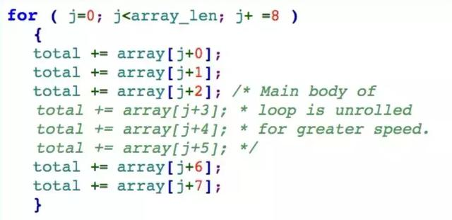

# **如何编写无法维护的代码**

> 让自己稳拿铁饭碗 ;-)— Roedy Green（翻译版略有删节）

# **简介**

> *永远不要（把自己遇到的问题）归因于（他人的）恶意，这恰恰说明了（你自己的）无能。 **— 拿破仑*

为了造福大众，在Java编程领域创造就业机会，兄弟我在此传授大师们的秘籍。这些大师写的代码极其难以维护，后继者就是想对它做最简单的修改都需要花上数年时间。而且，如果你能对照秘籍潜心修炼，你甚至可以给自己弄个铁饭碗，因为除了你之外，没人能维护你写的代码。再而且，如果你能练就秘籍中的全部招式，那么连你自己都无法维护你的代码了！

你不想练功过度走火入魔吧。那就不要让你的代码一眼看去就完全无法维护，只要它实质上是那样就行了。否则，你的代码就有被重写或重构的风险！

# **总体原则**

*Quidquid latine dictum sit, altum sonatur.*

*(随便用拉丁文写点啥都会显得高大上。)*

想挫败维护代码的程序员，你必须先明白他的思维方式。他接手了你的庞大程序，没有时间把它全部读一遍，更别说理解它了。他无非是想快速找到修改代码的位置、改代码、编译，然后就能交差，并希望他的修改不会出现意外的副作用。

他查看你的代码不过是管中窥豹，一次只能看到一小段而已。你要确保他永远看不到全貌。要尽量让他难以找到他想找的代码。但更重要的是，要让他不能有把握**忽略**任何东西。

程序员都被编程惯例洗脑了，还为此自鸣得意。每一次你处心积虑地违背编程惯例，都会迫使他必须用放大镜去仔细阅读你的每一行代码。

你可能会觉得每个语言特性都可以用来让代码难以维护，其实不然。你必须精心地误用它们才行。

# **命名**

> *“当我使用一个单词的时候” Humpty Dumpty 曾经用一种轻蔑的口气说, “它就是我想表达的意思，不多也不少。“**– Lewis Carroll — 《爱丽丝魔镜之旅》， 第6章*

编写无法维护代码的技巧的重中之重是变量和方法命名的艺术。如何命名是和编译器无关的。这就让你有巨大的自由度去利用它们迷惑维护代码的程序员。

**妙用 宝宝起名大全**

买本宝宝起名大全，你就永远不缺变量名了。比如 Fred 就是个好名字，而且键盘输入它也省事。如果你就想找一些容易输入的变量名，可以试试 adsf 或者 aoeu之类。

**单字母变量名**

如果你给变量起名为a,b,c，用简单的文本编辑器就没法搜索它们的引用。而且，没人能猜到它们的含义。

**首字母大写的缩写**

用首字母大写缩写（比如GNU 代表 GNU’s Not Unix) 使代码简洁难懂。真正的汉子(无论男女)从来不说明这种缩写的含义，他们生下来就懂。

**首字母大写**

随机地把单词中间某个音节的首字母大写。例如 ComputeReSult()。

**重用命名**

在语言规则允许的地方，尽量把类、构造器、方法、成员变量、参数和局部变量都命名成一样。更高级的技巧是在{}块中重用局部变量。这样做的目的是迫使维护代码的程序员认真检查每个实例的作用域。特别是在Java代码中，可以把普通方法伪装成构造器。

**使用非英语字母**

在命名中偷偷使用不易察觉的非英语字母，例如

typedef struct { int i; } ínt;

看上去没啥不对是吧？嘿嘿嘿…这里的第二个 ínt 的 í 实际上是东北欧字母，并不是英语中的 i 。在简单的文本编辑器里，想看出这一点点区别几乎是不可能的。

**巧妙利用编译器对于命名长度的限制**

如果编译器只区分命名的前几位，比如前8位，那么就把后面的字母写得不一样。比如，其实是同一个变量，有时候写成 var_unit_update() ，有时候又写成 var_unit_setup()，看起来是两个不同的函数调用。而在编译的时候，它们其实是同一个变量 var_unit。

**下划线，真正的朋友**

可以拿 _ 和 __ 作为标示符。

**其他语言的命名**

使用外语字典作为变量名的来源。例如，可以用德语单词 punkt 代替 point。除非维护代码的程序员也像你一样熟练掌握了德语. 不然他就只能尽情地在代码中享受异域风情了。

**数学命名**

用数学操作符的单词来命名变量。例如：

openParen = (slash + asterix) / equals;

(左圆括号 = (斜杠 + 星号)/等号;)

**令人眩晕的命名**

用带有完全不相关的感情色彩的单词来命名变量。例如：

marypoppins = (superman + starship) / god;

(欢乐满人间 = (超人 + 星河战队)/上帝;)

这一招可以让阅读代码的人陷入迷惑之中，因为他们在试图想清楚这些命名的逻辑时，会不自觉地联系到不同的感情场景里而无法自拔。

**何时使用 i**

永远不要把 i 用作最内层的循环变量。 用什么命名都行，就是别用i。把 i 用在其他地方就随便了，用作非整数变量尤其好。

**误导性的命名**

让每个方法都和它的名字蕴含的功能有一些差异。例如，一个叫 isValid(x)的方法在判断完参数x的合法性之后，还顺带着把它转换成二进制并保存到数据库里。

# **伪装**

> *当一个bug需要越长的时间才会暴露，它就越难被发现。**– Roedy Green（本文作者）*

编写无法维护代码的另一大秘诀就是伪装的艺术，即隐藏它或者让它看起来像其他东西。很多招式有赖于这样一个事实：编译器比肉眼或文本编辑器更有分辨能力。下面是一些伪装的最佳招式。

**把代码伪装成注释，反之亦然**

下面包括了一些被注释掉的代码，但是一眼看去却像是正常代码。

如果不是用单绿色标出来，你能注意到这三行代码被注释掉了么？

**用连接符隐藏变量**

对于下面的定义

#define local_var xy_z

可以把 “xy_z” 打散到两行里：

#define local_var xy
_z // local_var OK

这样全局搜索 xy_z 的操作在这个文件里就一无所获了。 对于 C 预处理器来说，第一行最后的 “” 表示继续拼接下一行的内容。

# **文档**

> *任何傻瓜都能说真话，而要把谎编圆则需要相当的智慧。**– Samuel Butler (1835 – 1902)**不正确的文档往往比没有文档还糟糕。**– Bertrand Meyer*

既然计算机是忽略注释和文档的，你就可以在里边堂而皇之地编织弥天大谎，让可怜的维护代码的程序员彻底迷失。

**在注释中撒谎**

实际上你不需要主动地撒谎，只要没有及时保持注释和代码更新的一致性就可以了。

**只记录显而易见的东西**

往代码里掺进去类似于

/* 给 i 加 1 */

这样的注释，但是永远不要记录包或者方法的整体设计这样的干货。

**记录 How 而不是 Why**

只解释一个程序功能的细节，而不是它要完成的任务是什么。这样的话，如果出现了一个bug，修复者就搞不清这里的代码应有的功能。

**该写的别写**

比如你在开发一套航班预定系统，那就要精心设计，让它在增加另一个航空公司的时候至少有25处代码需要修改。永远不要在文档里说明要修改的位置。后来的开发人员要想修改你的代码？门都没有，除非他们能把每一行代码都读懂。

**计量单位**

永远不要在文档中说明任何变量、输入、输出或参数的计量单位，如英尺、米、加仑等。计量单位对数豆子不是太重要，但在工程领域就相当重要了。万一有人挑刺儿，你就告诉他们，你这么做是为了把浮点数运算凑成整数运算而进行的转换。

**坑**

永远不要记录代码中的坑。如果你怀疑某个类里可能有bug，天知地知你知就好。如果你想到了重构或重写代码的思路，看在老天爷的份上，千万别写出来。切记“难得糊涂”四个字，这样大家都不会感觉受到了批评。

**说明变量**

永远不要对变量声明加注释。有关变量使用的方式、边界值、合法值、小数点后的位数、计量单位、显示格式、数据录入规则等等，后继者完全可以自己从程序代码中去理解和整理嘛。如果老板强迫你写注释，就在方法体里胡乱多写点，但绝对不要对变量声明写注释，即使是临时变量！

**在注释里挑拨离间**

为了阻挠任何雇佣外部维护承包商的倾向，可以在代码中散布针对其他同行软件公司的攻击和抹黑，特别是可能接替你工作的其中任何一家。例如：

/* 优化后的内层循环
这套技巧对于SSI软件服务公司的那帮蠢材来说太高深了，他们只会
用 <math.h> 里的笨例程，消耗50倍的内存和处理时间。
*/ 
class clever_SSInc
{ 
.. . 
}

可能的话，除了注释之外，这些攻击抹黑的内容也要掺到代码里的重要语义部分，这样如果管理层想清理掉这些攻击性的言论然后发给外部承包商去维护，就会破坏代码结构。

# **测试**

在程序里留些bug，让后继的维护代码的程序员能做点有意思的事。精心设计的bug是无迹可寻的，而且谁也不知道它啥时候会冒出来。要做到这一点，最简单的办法的就是不要测试代码。

**永不测试**

永远不要测试负责处理错误、当机或操作系统故障的任何代码。反正这些代码永远也不会执行，只会拖累你的测试。

**永远不要做性能测试**

嘿，如果软件运行不够快，只要告诉客户买个更快的机器就行了。

**永远不要写任何测试用例**

永远不要做代码覆盖率或路径覆盖率测试。自动化测试是给那些窝囊废用的。搞清楚哪些特性占到你的例程使用率的90%，然后把90%的测试用在这些路径上。毕竟说起来，这种方法可能只测试到了大约你代码的60%，这样你就节省了40%的测试工作。

# **与他人共事之道**

**老板才是真行家**

如果你的老板认为他20年的 FORTRAN 编程经验对于现代软件开发具有很高的指导价值，你务必严格采纳他的所有建议。投桃报李，你的老板也会信任你。这会对你的职业发展有利。你还会从他那里学到很多搞乱程序代码的新方法。

**颠覆技术支持**

确保代码中到处是bug的有效方法是永远不要让维护代码的程序员知道它们。这需要颠覆技术支持工作。永远不接电话。使用自动语音答复“感谢拨打技术支持热线。需要人工服务请按1，或在嘀声后留言。”，请求帮助的电子邮件必须忽略，不要给它分配服务追踪号。对任何问题的标准答复是“我估计你的账户被锁定了，有权限帮你恢复的人现在不在。”

# **其他杂七杂八的招**

> *如果你给某人一段程序，你会让他困惑一天；如果你教他们如何编程，你会让他困惑一辈子。 **— Anonymous*

**不要重编译**

让我们从一条可能是有史以来最友好的技巧开始：把代码编译成可执行文件。如果它能用，就在源代码里做一两个微小的改动 — 每个模块都照此办理。但是不要费劲巴拉地再编译一次了。 你可以留着等以后有空而且需要调试的时候再说。多年以后，等可怜的维护代码的程序员更改了代码之后发现出错了，他会有一种错觉，觉得这些肯定是他自己最近修改的。这样你就能让他毫无头绪地忙碌很长时间。

**挫败调试工具**

对于试图用行调试工具追踪来看懂你的代码的人，简单的一招就能让他狼狈不堪，那就是把每一行代码都写得很长。特别要把 then 语句 和 if 语句放在同一行里。他们无法设置断点。他们也无法分清在看的分支是哪个 if 里的。

**公制和美制**

在工程方面有两种编码方式。一种是把所有输入都转换为公制（米制）计量单位，然后在输出的时候自己换算回各种民用计量单位。另一种是从头到尾都保持各种计量单位混合在一起。总是选择第二种方式，这就是美国之道！

**持续改进**

要持续不懈地改进。要常常对你的代码做出“改进”，并强迫用户经常升级 — 毕竟没人愿意用一个过时的版本嘛。即便他们觉得他们对现有的程序满意了，想想看，如果他们看到你又“完善“了它，他们会多么开心啊！不要告诉任何人版本之间的差别，除非你被逼无奈 — 毕竟，为什么要告诉他们本来永远也不会注意到的一些bug呢？

**“关于”**

”关于“一栏应该只包含程序名、程序员姓名和一份用法律用语写的版权声明。理想情况下，它还应该链接到几 MB 的代码，产生有趣的动画效果。但是，里边永远不要包含程序用途的描述、它的版本号、或最新代码修改日期、或获取更新的网站地址、或作者的email地址等。这样，所有的用户很快就会运行在各种不同的版本上，在安装N+1版之前就试图安装N+2版。

**变更**

在两个版本之间，你能做的变更自然是多多益善。你不会希望用户年复一年地面对同一套老的接口或用户界面，这样会很无聊。最后，如果你能在用户不注意的情况下做出这些变更，那就更好了 — 这会让他们保持警惕，戒骄戒躁。

**无需技能**

写无法维护代码不需要多高的技术水平。喊破嗓子不如甩开膀子，不管三七二十一开始写代码就行了。记住，管理层还在按代码行数考核生产率，即使以后这些代码里的大部分都得删掉。

**只带一把锤子**

一招鲜吃遍天，会干什么就吆喝什么，轻装前进。如果你手头只有一把锤子，那么所有的问题都是钉子。

**规范体系**

有可能的话，忽略当前你的项目所用语言和环境中被普罗大众所接受的编程规范。比如，编写基于MFC 的应用时，就坚持使用STL 编码风格。

**翻转通常的 True False 惯例**

把常用的 true 和 false 的定义反过来用。这一招听起来平淡无奇，但是往往收获奇效。你可以先藏好下面的定义：

#define TRUE 0 
#define FALSE 1

把这个定义深深地藏在代码中某个没人会再去看的文件里不易被发现的地方，然后让程序做下面这样的比较

if ( var == TRUE )
if ( var != FALSE )

某些人肯定会迫不及待地跳出来“修正”这种明显的冗余，并且在其他地方照着常规去使用变量var：

if ( var )

还有一招是为 TRUE 和 FALSE赋予相同的值，虽然大部分人可能会看穿这种骗局。给它们分别赋值 1 和 2 或者 -1 和 0 是让他们瞎忙乎的方式里更精巧的，而且这样做看起来也不失对他们的尊重。你在Java 里也可以用这一招，定义一个叫 TRUE 的静态常量。在这种情况下，其他程序员更有可能怀疑你干的不是好事，因为Java里已经有了内建的标识符 true。

**第三方库**

在你的项目里引入功能强大的第三方库，然后不要用它们。潜规则就是这样，虽然你对这些工具仍然一无所知，却可以在你简历的“其他工具”一节中写上这些没用过的库。

**不要用库**

假装不知道有些库已经直接在你的开发工具中引入了。如果你用VC++编程，忽略MFC 或 STL 的存在，手工编写所有字符串和数组的实现；这样有助于保持你玩指针技术的高水平，并自动阻止任何扩展代码功能的企图。

**创建一套Build顺序**

把这套顺序规则做得非常晦涩，让维护者根本无法编译任何他的修改代码。秘密保留 SmartJ ，它会让 make脚本形同废物。类似地，偷偷地定义一个 javac 类，让它和编译程序同名。说到大招，那就是编写和维护一个定制的小程序，在程序里找到需要编译的文件，然后通过直接调用 sun.tools.javac.Main 编译类来进行编译。

**Make 的更多玩法**

用一个 makefile-generated-batch-file 批处理文件从多个目录复制源文件，文件之间的覆盖规则在文档中是没有的。这样，无需任何炫酷的源代码控制系统，就能实现代码分支，并阻止你的后继者弄清哪个版本的 DoUsefulWork() 才是他需要修改的那个。

**搜集编码规范**

尽可能搜集所有关于编写可维护代码的建议，例如 SquareBox 的建议 ，然后明目张胆地违反它们。

**规避公司的编码规则**

某些公司有严格的规定，不允许使用数字标识符，你必须使用预先命名的常量。要挫败这种规定背后的意图太容易了。比如，一位聪明的 C++ 程序员是这么写的：

>#define K_ONE 1 
#define K_TWO 2 
#define K_THOUSAND 999

**编译器警告**

一定要保留一些编译器警告。在 make 里使用 “-” 前缀强制执行，忽视任何编译器报告的错误。这样，即使维护代码的程序员不小心在你的源代码里造成了一个语法错误，make 工具还是会重新把整个包build 一遍，甚至可能会成功！而任何程序员要是手工编译你的代码，看到屏幕上冒出一堆其实无关紧要的警告，他们肯定会觉得是自己搞坏了代码。同样，他们一定会感谢你让他们有找错的机会。学有余力的同学可以做点手脚让编译器在打开编译错误诊断工具时就没法编译你的程序。当然了，编译器也许能做一些脚本边界检查，但是真正的程序员是不用这些特性的，所以你也不该用。既然你用自己的宝贵时间就能找到这些精巧的bug，何必还多此一举让编译器来检查错误呢？

**把 bug 修复和升级混在一起**

永远不要发布什么“bug 修复”版本。一定要把 bug 修复和数据库结构变更、复杂的用户界面修改，还有管理界面重写等混在一起。那样的话，升级就变成一件非常困难的事情，人们会慢慢习惯 bug 的存在并开始称他们为特性。那些真心希望改变这些”特性“的人们就会有动力升级到新版本。这样从长期来说可以节省你的维护工作量，并从你的客户那里获得更多收入。

**在你的产品发布每个新版本的时候都改变文件结构**

没错，你的客户会要求向上兼容，那就去做吧。不过一定要确保向下是不兼容的。这样可以阻止客户从新版本回退，再配合一套合理的 bug 修复规则（见上一条），就可以确保每次新版本发布后，客户都会留在新版本。学有余力的话，还可以想办法让旧版本压根无法识别新版本产生的文件。那样的话，老版本系统不但无法读取新文件，甚至会否认这些文件是自己的应用系统产生的！温馨提示：PC 上的 Word 文字处理软件就典型地精于此道。

**抵消 Bug**

不用费劲去代码里找 bug 的根源。只要在更高级的例程里加入一些抵销它的代码就行了。这是一种很棒的智力测验，类似于玩3D棋，而且能让将来的代码维护者忙乎很长时间都想不明白问题到底出在哪里：是产生数据的低层例程，还是莫名其妙改了一堆东西的高层代码。这一招对天生需要多回合执行的编译器也很好用。你可以在较早的回合完全避免修复问题，让较晚的回合变得更加复杂。如果运气好，你永远都不用和编译器前端打交道。学有余力的话，在后端做点手脚，一旦前端产生的是正确的数据，就让后端报错。

**使用旋转锁**

不要用真正的同步原语，多种多样的旋转锁更好 — 反复休眠然后测试一个(non-volatile的) 全局变量，直到它符合你的条件为止。相比系统对象，旋转锁使用简便，”通用“性强，”灵活“多变，实为居家旅行必备。

**随意安插 sync 代码**

把某些系统同步原语安插到一些用不着它们的地方。本人曾经在一段不可能会有第二个线程的代码中看到一个临界区（critical section）代码。本人当时就质问写这段代码的程序员，他居然理直气壮地说这么写是为了表明这段代码是很”关键“（单词也是critical）的！

**优雅降级**

如果你的系统包含了一套 NT 设备驱动，就让应用程序负责给驱动分配 I/O 缓冲区，然后在任何事务过程中对内存中的驱动加锁，并在事务完成后释放或解锁。这样一旦应用非正常终止，I/O缓存又没有被解锁，NT服务器就会当机。但是在客户现场不太可能会有人知道怎么弄好设备驱动，所以他们就没有选择（只能请你去免费旅游了）。

**定制脚本语言**

在你的 C/S 应用里嵌入一个在运行时按字节编译的脚本命令语言。

**依赖于编译器的代码**

如果你发现在你的编译器或解释器里有个bug，一定要确保这个bug的存在对于你的代码正常工作是至关重要的。毕竟你又不会使用其他的编译器，其他任何人也不允许！

**一个货真价实的例子**

下面是一位大师编写的真实例子。让我们来瞻仰一下他在这样短短几行 C 函数里展示的高超技巧。

void* Realocate(void*buf, int os, int ns) 
{
 void*temp; 
 temp = malloc(os); 
 memcpy((void*)temp, (void*)buf, os); 
 free(buf); 
 buf = malloc(ns); 
 memset(buf, 0, ns); 
 memcpy((void*)buf, (void*)temp, ns); 
 return buf;
}

*   重新发明了标准库里已有的简单函数。
*   Realocate 这个单词拼写错误。所以说，永远不要低估创造性拼写的威力。
*   无缘无故地给输入缓冲区产生一个临时的副本。
*   无缘无故地造型。 memcpy() 里有 (void*)，这样即使我们的指针已经是 (void*) 了也要再造型一次。另外，这样做可以传递任何东西作为参数，加10分。
*   永远不必费力去释放临时内存空间。这样会导致缓慢的内存泄露，一开始看不出来，要程序运行一段时间才行。
*   把用不着的东西也从缓冲区里拷贝出来，以防万一。这样只会在Unix上产生core dump，Windows 就不会。
*   很显然，os 和 ns 的含义分别是”old size” 和 “new size”。
*   给 buf 分配内存之后，memset 初始化它为 0。不要使用 calloc()，因为某些人会重写 ANSI 规范，这样将来保不齐 calloc() 往 buf 里填的就不是 0 了。（虽然我们复制过去的数据量和 buf 的大小是一样的，不需要初始化，不过这也无所谓啦）

**如何修复 “unused variable” 错误**

如果你的编译器冒出了 “unused local variable” 警告，不要去掉那个变量。相反，要找个聪明的办法把它用起来。我最喜欢的方法是：

i = i;

**大小很关键**

差点忘了说了，函数是越大越好。跳转和 GOTO 语句越多越好。那样的话，想做任何修改都需要分析很多场景。这会让维护代码的程序员陷入千头万绪之中。如果函数真的体型庞大的话，对于维护代码的程序员就是哥斯拉怪兽了，它会在他搞清楚情况之前就残酷无情地将他踩翻在地。

**一张图片顶1000句话，一个函数就是1000行**

把每个方法体写的尽可能的长 — 最好是你写的任何一个方法或函数都不会少于1000行代码，而且里边是深度嵌套，这是必须的。

**少个文件**

一定要保证一个或多个关键文件无法找到。利用includes 里边再 includes 就能做到这一点。例如，在你的 main 模块里，你写上：

#include <stdcode.h>

Stdcode.h 是有的。但是在 stdcode.h 里，还有个引用：

#include "a:\refcode.h"

然后，refcode.h 就没地方能找到了。

（【译者-老码农-注】为啥找不到呢？仔细看看，现在还有人知道 a: 是什么吗？A盘！传说中的软盘…）

**到处都写，无处会读**

至少要把一个变量弄成这样：到处被设置，但是几乎没有哪里用到它。不幸的是，现代编译器通常会阻止你做相反的事：到处读，没处写。不过你在C 或 C++ 里还是可以这样做的。
